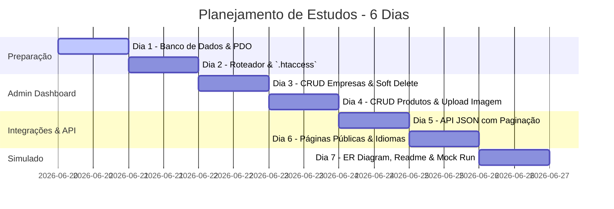

# 🚀 Rota de Estudos Acelerada: Prova TP_B (Módulo B)
## Como Aprender e Implementar Tudo do Zero em 6 Dias

Este roteiro foi redesenhado especialmente para você, considerando que atualmente você domina redirecionamentos e formulários básicos de PHP. A prova **TP_B (Module B)** exige que você crie um sistema completo de gerenciamento de produtos com banco de dados, roteamento limpo, APIs JSON, upload de arquivos e páginas públicas dinâmicas.

Nosso objetivo é que você aprenda a construir cada parte **de cabeça (sem olhar código pronto)** ao longo de **6 dias**. Você treinará cada etapa escrevendo tudo do zero até memorizar o padrão.

---

## 📅 Cronograma de Estudos (Meta: Finalizar em 6 Dias)



---

## 🗄️ DIA 1: Banco de Dados MySQL e Conexão PDO
**Objetivo:** Modelar as tabelas no MySQL, gerar o arquivo de dump `.sql` e criar a conexão no PHP usando PDO.

### 💡 O que você precisa aprender:
1. **O que é PDO?** É a forma moderna e segura de se conectar ao banco de dados no PHP. Ele previne ataques como SQL Injection automaticamente quando usamos parâmetros preparados.
2. **Esquema Relacional (Foreign Keys):** Um produto pertence a uma empresa. Logo, a tabela `products` precisa de uma chave estrangeira (`company_id`) apontando para `companies(id)`.
3. **Indexação:** A prova exige que o campo `gtin` seja indexado e único para melhorar a velocidade das consultas.

### 📝 O Código que você deve memorizar:

#### 1. Estrutura do Banco (`db.sql`)
Crie e salve este script de banco para rodar no seu MySQL:
```sql
CREATE DATABASE IF NOT EXISTS ws_module_b CHARACTER SET utf8mb4 COLLATE utf8mb4_unicode_ci;
USE ws_module_b;

CREATE TABLE companies (
    id INT AUTO_INCREMENT PRIMARY KEY,
    name VARCHAR(255) NOT NULL,
    address TEXT NOT NULL,
    telephone VARCHAR(50) NOT NULL,
    email VARCHAR(255) NOT NULL,
    owner_name VARCHAR(255) NOT NULL,
    owner_mobile VARCHAR(50) NOT NULL,
    owner_email VARCHAR(255) NOT NULL,
    contact_name VARCHAR(255) NOT NULL,
    contact_mobile VARCHAR(50) NOT NULL,
    contact_email VARCHAR(255) NOT NULL,
    deactivated TINYINT(1) DEFAULT 0 COMMENT '0=ativo, 1=desativado'
);

CREATE TABLE products (
    id INT AUTO_INCREMENT PRIMARY KEY,
    company_id INT NOT NULL,
    gtin VARCHAR(14) NOT NULL UNIQUE,
    name_en VARCHAR(255) NOT NULL,
    name_fr VARCHAR(255) NOT NULL,
    description_en TEXT NOT NULL,
    description_fr TEXT NOT NULL,
    brand VARCHAR(255) NOT NULL,
    country VARCHAR(100) NOT NULL,
    weight_gross DECIMAL(10,2) NOT NULL,
    weight_net DECIMAL(10,2) NOT NULL,
    weight_unit VARCHAR(10) NOT NULL,
    image_path VARCHAR(255) DEFAULT 'assets/placeholder.png',
    hidden TINYINT(1) DEFAULT 0 COMMENT '0=visivel, 1=oculto',
    FOREIGN KEY (company_id) REFERENCES companies(id) ON DELETE CASCADE,
    INDEX (gtin)
);
```

#### 2. Conexão PDO em PHP (`db.php`)
Escreva uma conexão limpa usando try-catch para capturar erros:
```php
<?php
// db.php
try {
    $pdo = new PDO("mysql:host=localhost;dbname=ws_module_b;charset=utf8mb4", "root", "", [
        PDO::ATTR_ERRMODE => PDO::ERRMODE_EXCEPTION, // Lança exceções em caso de erros SQL
        PDO::ATTR_DEFAULT_FETCH_MODE => PDO::FETCH_ASSOC // Retorna os dados como array associativo
    ]);
} catch (PDOException $e) {
    die("Erro ao conectar ao banco de dados: " . $e->getMessage());
}
```

### 🏋️ Exercício do Dia:
Delete o banco no MySQL, crie de novo e escreva o `db.php` do zero, sem olhar para este arquivo, até que a conexão funcione perfeitamente.

---

## 🌐 DIA 2: Roteamento Limpo com `.htaccess` e index.php
**Objetivo:** Configurar URLs amigáveis (como `/login` e `/products/3000123456789`) apontando para um arquivo central de roteamento, e proteger rotas administrativas (Erro 401).

### 💡 O que você precisa aprender:
1. **URL Rewrite (.htaccess):** O servidor Apache lê este arquivo e redireciona qualquer requisição de página para o index.php sem alterar a URL na barra de endereços.
2. **Obtenção da Rota Dinâmica:** Como o projeto pode rodar dentro de uma subpasta (ex: `/XX_module_b`), precisamos extrair o diretório base dinamicamente no PHP para ler apenas a rota real.
3. **Expressões Regulares (Regex):** O PHP usa `preg_match` para identificar URLs com parâmetros variáveis, como `/products/[GTIN]` (onde GTIN é uma sequência de 13 ou 14 números).

### 📝 O Código que você deve memorizar:

#### 1. Configuração do Servidor (`.htaccess`)
Crie o arquivo `.htaccess` exatamente assim:
```apache
RewriteEngine On
RewriteCond %{REQUEST_FILENAME} !-f
RewriteCond %{REQUEST_FILENAME} !-d
RewriteRule ^(.*)$ index.php [QSA,L]
```

#### 2. O Roteador Central (`index.php`)
```php
<?php
// index.php
session_start();
require_once 'db.php';

// 1. Detectar o diretório de subpasta dinamicamente
$base_dir = dirname($_SERVER['SCRIPT_NAME']);
$request_uri = parse_url($_SERVER['REQUEST_URI'], PHP_URL_PATH);

if ($base_dir !== '/' && strpos($request_uri, $base_dir) === 0) {
    $path = substr($request_uri, strlen($base_dir));
} else {
    $path = $request_uri;
}
$path = '/' . trim($path, '/');

// 2. Função auxiliar para proteger páginas admin (B1/B4)
function check_auth() {
    if (!isset($_SESSION['logged_in']) || $_SESSION['logged_in'] !== true) {
        http_response_code(401);
        echo "<h1>401 Unauthorized</h1><p>Acesso negado.</p>";
        exit;
    }
}

// 3. Sistema de Switch para mapear rotas estáticas e dinâmicas
switch ($path) {
    case '/login':
        require 'login.php';
        break;
    case '/logout':
        session_destroy();
        header("Location: " . $base_dir . "/login");
        exit;
    case '/companies':
        check_auth();
        require 'companies_list.php';
        break;
    case '/companies/new':
        check_auth();
        require 'company_create.php';
        break;
    case '/products':
        check_auth();
        require 'products_list.php';
        break;
    case '/products/new':
        check_auth();
        require 'product_create.php';
        break;
    case '/products.json':
        require 'api_products_list.php';
        break;
    case '/gtin-verify':
        require 'public_gtin_verify.php';
        break;
    default:
        // 4. Rotas Dinâmicas usando Regex para capturar o GTIN (13 ou 14 dígitos)
        
        // Detalhes do Produto (Admin) -> /products/[GTIN]
        if (preg_match('#^/products/([0-9]{13,14})$#', $path, $matches)) {
            check_auth();
            $_GET['gtin'] = $matches[1];
            require 'product_detail.php';
            break;
        }
        
        // API Detalhe do Produto -> /products/[GTIN].json
        if (preg_match('#^/products/([0-9]{13,14})\.json$#', $path, $matches)) {
            $_GET['gtin'] = $matches[1];
            require 'api_product_detail.php';
            break;
        }
        
        // Página Pública do Produto -> /01/[GTIN]
        if (preg_match('#^/01/([0-9]{13,14})$#', $path, $matches)) {
            $_GET['gtin'] = $matches[1];
            require 'public_product.php';
            break;
        }

        // Redirecionamento padrão se a rota não existir
        if (isset($_SESSION['logged_in'])) {
            header("Location: " . $base_dir . "/companies");
        } else {
            header("Location: " . $base_dir . "/login");
        }
        exit;
}
```

### 🏋️ Exercício do Dia:
Escreva o arquivo `.htaccess` e crie um roteador `index.php` simples. Teste digitando URLs que não existem no navegador e verifique se elas caem no redirecionamento correto.

---

## 🏢 DIA 3: CRUD de Empresas e Soft Delete
**Objetivo:** Implementar a listagem, criação de empresas e a regra especial de desativação (Soft Delete) usando transações do banco de dados.

### 💡 O que você precisa aprender:
1. **Consulta Segura com PDO:** Sempre prepare queries (`$pdo->prepare()`) quando houver inputs do usuário.
2. **Soft Delete (Desativação):** Em vez de excluir a empresa com `DELETE FROM`, mudamos o campo `deactivated` para `1`.
3. **Transações Bancárias (Transactions):** A regra da prova diz: *Quando uma empresa for desativada, todos os produtos relacionados a ela devem ser marcados como ocultos (`hidden = 1`)*. Para garantir que ambas as atualizações funcionem juntas ou falhem juntas, usamos `beginTransaction()`, `commit()` e `rollBack()`.

### 📝 O Código que você deve memorizar:

#### 1. Listagem de Empresas (`companies_list.php`)
```php
<?php
// companies_list.php
$show_deactivated = isset($_GET['type']) && $_GET['type'] === 'deactivated';
$status_val = $show_deactivated ? 1 : 0;

$stmt = $pdo->prepare("SELECT * FROM companies WHERE deactivated = ? ORDER BY name ASC");
$stmt->execute([$status_val]);
$companies = $stmt->fetchAll();
?>
<h1>Painel Admin - Empresas</h1>
<a href="companies/new">Cadastrar Nova Empresa</a> | 
<?php if ($show_deactivated): ?>
    <a href="companies">Ver Empresas Ativas</a>
<?php else: ?>
    <a href="companies?type=deactivated">Ver Empresas Desativadas</a>
<?php endif; ?>

<table border="1" cellpadding="10" style="margin-top: 20px; width: 100%;">
    <thead>
        <tr>
            <th>Nome</th>
            <th>Telefone</th>
            <th>Email</th>
            <th>Contato Responsável</th>
            <th>Ações</th>
        </tr>
    </thead>
    <tbody>
        <?php foreach ($companies as $c): ?>
            <tr>
                <td><?= htmlspecialchars($c['name']) ?></td>
                <td><?= htmlspecialchars($c['telephone']) ?></td>
                <td><?= htmlspecialchars($c['email']) ?></td>
                <td><?= htmlspecialchars($c['contact_name']) ?></td>
                <td>
                    <?php if (!$show_deactivated): ?>
                        <a href="companies/deactivate?id=<?= $c['id'] ?>" onclick="return confirm('Deseja desativar esta empresa?')">Desativar (Soft Delete)</a>
                    <?php endif; ?>
                </td>
            </tr>
        <?php endforeach; ?>
    </tbody>
</table>
```

#### 2. Desativação com Transação PDO (`companies_deactivate.php`)
Adicione esta rota no `index.php` caso queira modularizar ou chame a lógica:
```php
<?php
// companies_deactivate.php
$id = $_GET['id'] ?? null;
if ($id) {
    try {
        $pdo->beginTransaction(); // Inicia a transação segura
        
        // 1. Desativa a empresa
        $stmt1 = $pdo->prepare("UPDATE companies SET deactivated = 1 WHERE id = ?");
        $stmt1->execute([$id]);

        // 2. Oculta todos os produtos daquela empresa (Regra de Negócio CIS)
        $stmt2 = $pdo->prepare("UPDATE products SET hidden = 1 WHERE company_id = ?");
        $stmt2->execute([$id]);

        $pdo->commit(); // Salva as duas operações se não houver erros
    } catch (Exception $e) {
        $pdo->rollBack(); // Desfaz tudo se alguma query falhar
        die("Falha na desativação: " . $e->getMessage());
    }
}
header("Location: companies");
exit;
```

### 🏋️ Exercício do Dia:
Crie uma tela para cadastrar empresas e uma de listagem. Implemente a lógica de desativação (soft delete) usando transações e verifique no banco de dados se os produtos associados mudam para `hidden = 1` após a empresa ser desativada.

---

## 📦 DIA 4: CRUD de Produtos, Upload e Multilíngue
**Objetivo:** Criar e gerenciar produtos, validar GTIN no servidor, permitir uploads de imagem com placeholder padrão, e aplicar a exclusão definitiva apenas para produtos ocultos.

### 💡 O que você precisa aprender:
1. **Validação de GTIN:** Verificar se possui apenas números (`ctype_digit()`), se tem comprimento exato de 13 ou 14 caracteres (`strlen()`), e se já não existe no banco.
2. **Produtos Multilíngue:** Fornecer campos diferentes no formulário para Nome e Descrição em Inglês e Francês (`name_en`, `name_fr`, `description_en`, `description_fr`).
3. **Upload Seguro de Imagens:** Usar a variável global `$_FILES`, conferir erros de upload, mover o arquivo com `move_uploaded_file()` e salvar o caminho no banco. Se o usuário não selecionar arquivo, usar o caminho do placeholder `assets/placeholder.png`.
4. **Exclusão Segura:** O botão de excluir fisicamente o produto do banco só deve estar visível se o produto estiver com `hidden = 1` (ou a empresa desativada).

### 📝 O Código que você deve memorizar:

#### 1. Criação de Produto com Upload e Validações (`product_create.php`)
```php
<?php
// product_create.php
$companiesStmt = $pdo->query("SELECT id, name FROM companies WHERE deactivated = 0");
$companies = $companiesStmt->fetchAll();

$errors = [];

if ($_SERVER['REQUEST_METHOD'] === 'POST') {
    $company_id = $_POST['company_id'] ?? '';
    $gtin = trim($_POST['gtin'] ?? '');
    $name_en = trim($_POST['name_en'] ?? '');
    $name_fr = trim($_POST['name_fr'] ?? '');
    $desc_en = trim($_POST['desc_en'] ?? '');
    $desc_fr = trim($_POST['desc_fr'] ?? '');
    $brand = trim($_POST['brand'] ?? '');
    $country = trim($_POST['country'] ?? '');
    $weight_gross = $_POST['weight_gross'] ?? '';
    $weight_net = $_POST['weight_net'] ?? '';
    $weight_unit = $_POST['weight_unit'] ?? '';

    // 1. Validação de GTIN
    if (!ctype_digit($gtin) || (strlen($gtin) !== 13 && strlen($gtin) !== 14)) {
        $errors[] = "O GTIN deve ter exatamente 13 ou 14 dígitos numéricos.";
    } else {
        $checkGtin = $pdo->prepare("SELECT id FROM products WHERE gtin = ?");
        $checkGtin->execute([$gtin]);
        if ($checkGtin->fetch()) {
            $errors[] = "Este GTIN já está registrado.";
        }
    }

    // 2. Upload de Imagem
    $imagePath = 'assets/placeholder.png'; // Padrão
    if (isset($_FILES['image']) && $_FILES['image']['error'] === UPLOAD_ERR_OK) {
        $uploadDir = 'uploads/';
        if (!is_dir($uploadDir)) {
            mkdir($uploadDir, 0777, true);
        }
        $fileExtension = pathinfo($_FILES['image']['name'], PATHINFO_EXTENSION);
        $newFileName = uniqid('img_', true) . '.' . $fileExtension;
        $targetFilePath = $uploadDir . $newFileName;
        
        if (move_uploaded_file($_FILES['image']['tmp_name'], $targetFilePath)) {
            $imagePath = $targetFilePath;
        } else {
            $errors[] = "Erro ao fazer upload da imagem.";
        }
    }

    // 3. Salvando no Banco de Dados
    if (empty($errors)) {
        $sql = "INSERT INTO products (company_id, gtin, name_en, name_fr, description_en, description_fr, brand, country, weight_gross, weight_net, weight_unit, image_path, hidden) 
                VALUES (?, ?, ?, ?, ?, ?, ?, ?, ?, ?, ?, ?, 0)";
        $stmt = $pdo->prepare($sql);
        $stmt->execute([
            $company_id, $gtin, $name_en, $name_fr, $desc_en, $desc_fr, 
            $brand, $country, $weight_gross, $weight_net, $weight_unit, $imagePath
        ]);
        header("Location: products");
        exit;
    }
}
?>
<!-- Formulário HTML -->
<h1>Novo Produto</h1>
<?php foreach ($errors as $e): ?>
    <p style="color:red;"><?= $e ?></p>
<?php endforeach; ?>
<form method="POST" enctype="multipart/form-data">
    <label>Empresa:</label>
    <select name="company_id" required>
        <?php foreach ($companies as $c): ?>
            <option value="<?= $c['id'] ?>"><?= htmlspecialchars($c['name']) ?></option>
        <?php endforeach; ?>
    </select><br><br>
    
    <label>GTIN:</label>
    <input type="text" name="gtin" required><br><br>

    <label>Nome (EN):</label>
    <input type="text" name="name_en" required>
    <label>Nome (FR):</label>
    <input type="text" name="name_fr" required><br><br>

    <label>Descrição (EN):</label>
    <textarea name="desc_en" required></textarea>
    <label>Descrição (FR):</label>
    <textarea name="desc_fr" required></textarea><br><br>

    <label>Marca:</label>
    <input type="text" name="brand" required>
    <label>País de Origem:</label>
    <input type="text" name="country" value="France" required><br><br>

    <label>Peso Bruto:</label>
    <input type="number" step="0.01" name="weight_gross" required>
    <label>Peso Líquido:</label>
    <input type="number" step="0.01" name="weight_net" required>
    <label>Unidade:</label>
    <input type="text" name="weight_unit" placeholder="g / kg / L" required><br><br>

    <label>Imagem do Produto:</label>
    <input type="file" name="image" accept="image/*"><br><br>

    <button type="submit">Cadastrar Produto</button>
</form>
```

#### 2. Exclusão Segura de Produtos (`product_delete.php`)
```php
<?php
// product_delete.php
$id = $_GET['id'] ?? null;
if ($id) {
    // Apenas permite a exclusão se o produto estiver de fato oculto (hidden = 1)
    $stmt = $pdo->prepare("SELECT image_path, hidden FROM products WHERE id = ?");
    $stmt->execute([$id]);
    $product = $stmt->fetch();

    if ($product && $product['hidden'] == 1) {
        // Remove a imagem antiga do disco caso não seja o placeholder padrão
        if ($product['image_path'] !== 'assets/placeholder.png' && file_exists($product['image_path'])) {
            unlink($product['image_path']);
        }
        $deleteStmt = $pdo->prepare("DELETE FROM products WHERE id = ?");
        $deleteStmt->execute([$id]);
    }
}
header("Location: products");
exit;
```

### 🏋️ Exercício do Dia:
Implemente o formulário de cadastro de produto com upload de imagem. Crie regras no PHP para aceitar apenas GTIN de 13 ou 14 números. Crie um botão de exclusão que apareça apenas para produtos cujo campo `hidden` seja igual a `1` ou cuja empresa esteja desativada.

---

## 🔌 DIA 5: API JSON com Paginação e Filtros
**Objetivo:** Desenvolver endpoints em formato JSON para listagem de produtos com paginação e busca por query, e retorno dinâmico por GTIN (com erro 404 apropriado).

### 💡 O que você precisa aprender:
1. **Cabeçalhos HTTP:** Informar ao cliente que o conteúdo retornado é JSON, definindo o Header `Content-Type: application/json`.
2. **Filtro SQL LIKE:** Se o usuário passar `?query=algo`, buscar nos campos multilíngues (`name_en`, `name_fr`, `description_en`, `description_fr`) usando a cláusula SQL `LIKE %query%`.
3. **Lógica de Paginação:** Fazer o cálculo do limite (`LIMIT`) e do deslocamento (`OFFSET`) com base no parâmetro `?page` da URL, gerando os links corretos para `next_page_url` e `prev_page_url`.
4. **Respostas HTTP corretas:** Se o produto consultado por GTIN não existir ou estiver oculto (`hidden = 1`), retornar um cabeçalho `HTTP/1.1 404 Not Found` no PHP.

### 📝 O Código que você deve memorizar:

#### 1. API Lista de Produtos (`api_products_list.php`)
```php
<?php
// api_products_list.php
header('Content-Type: application/json; charset=utf-8');

$query = trim($_GET['query'] ?? '');
$page = isset($_GET['page']) ? (int)$_GET['page'] : 1;
if ($page < 1) $page = 1;
$limit = 10;
$offset = ($page - 1) * $limit;

// 1. Construindo query SQL de busca
$sql = "SELECT p.*, c.name as comp_name, c.address as comp_addr, c.telephone as comp_tel, c.email as comp_email, 
               c.owner_name, c.owner_mobile, c.owner_email, c.contact_name, c.contact_mobile, c.contact_email 
        FROM products p 
        JOIN companies c ON p.company_id = c.id 
        WHERE p.hidden = 0";

$params = [];
if (!empty($query)) {
    $sql .= " AND (p.name_en LIKE ? OR p.name_fr LIKE ? OR p.description_en LIKE ? OR p.description_fr LIKE ?)";
    $search = "%$query%";
    $params = [$search, $search, $search, $search];
}

// 2. Buscar o total de registros para a paginação
$countSql = "SELECT COUNT(*) FROM (" . $sql . ") as temp";
$countStmt = $pdo->prepare($countSql);
$countStmt->execute($params);
$totalItems = (int)$countStmt->fetchColumn();
$totalPages = ceil($totalItems / $limit);

// 3. Buscar os dados limitados por página
$sql .= " LIMIT $limit OFFSET $offset";
$stmt = $pdo->prepare($sql);
$stmt->execute($params);
$products = $stmt->fetchAll();

// 4. Estruturar a resposta exatamente como solicitado pelo CIS
$data = [];
foreach ($products as $p) {
    $data[] = [
        "name" => ["en" => $p['name_en'], "fr" => $p['name_fr']],
        "description" => ["en" => $p['description_en'], "fr" => $p['description_fr']],
        "gtin" => $p['gtin'],
        "brand" => $p['brand'],
        "countryOfOrigin" => $p['country'],
        "weight" => [
            "gross" => (float)$p['weight_gross'],
            "net" => (float)$p['weight_net'],
            "unit" => $p['weight_unit']
        ],
        "company" => [
            "companyName" => $p['comp_name'],
            "companyAddress" => $p['comp_addr'],
            "companyTelephone" => $p['comp_tel'],
            "companyEmail" => $p['comp_email'],
            "owner" => [
                "name" => $p['owner_name'],
                "mobileNumber" => $p['owner_mobile'],
                "email" => $p['owner_email']
            ],
            "contact" => [
                "name" => $p['contact_name'],
                "mobileNumber" => $p['contact_mobile'],
                "email" => $p['contact_email']
            ]
        ]
    ];
}

// 5. Configurar URLs de paginação
$scheme = isset($_SERVER['HTTPS']) && $_SERVER['HTTPS'] === 'on' ? 'https' : 'http';
$current_url = "$scheme://$_SERVER[HTTP_HOST]" . dirname($_SERVER['SCRIPT_NAME']) . "/products.json";

$next_page = ($page < $totalPages) ? $current_url . "?page=" . ($page + 1) . (!empty($query) ? "&query=" . urlencode($query) : "") : null;
$prev_page = ($page > 1) ? $current_url . "?page=" . ($page - 1) . (!empty($query) ? "&query=" . urlencode($query) : "") : null;

echo json_encode([
    "data" => $data,
    "pagination" => [
        "current_page" => $page,
        "total_pages" => $totalPages,
        "per_page" => $limit,
        "next_page_url" => $next_page,
        "prev_page_url" => $prev_page
    ]
], JSON_PRETTY_PRINT | JSON_UNESCAPED_SLASHES);
```

#### 2. API Detalhes por GTIN (`api_product_detail.php`)
```php
<?php
// api_product_detail.php
header('Content-Type: application/json; charset=utf-8');

$gtin = $_GET['gtin'] ?? '';

$stmt = $pdo->prepare("SELECT p.*, c.name as comp_name, c.address as comp_addr, c.telephone as comp_tel, c.email as comp_email, 
                              c.owner_name, c.owner_mobile, c.owner_email, c.contact_name, c.contact_mobile, c.contact_email 
                       FROM products p 
                       JOIN companies c ON p.company_id = c.id 
                       WHERE p.gtin = ? AND p.hidden = 0");
$stmt->execute([$gtin]);
$p = $stmt->fetch();

if (!$p) {
    http_response_code(404); // CIS exige o retorno de erro 404 nas APIs
    echo json_encode(["error" => "Product not found or is hidden"], JSON_PRETTY_PRINT);
    exit;
}

echo json_encode([
    "name" => ["en" => $p['name_en'], "fr" => $p['name_fr']],
    "description" => ["en" => $p['description_en'], "fr" => $p['description_fr']],
    "gtin" => $p['gtin'],
    "brand" => $p['brand'],
    "countryOfOrigin" => $p['country'],
    "weight" => [
        "gross" => (float)$p['weight_gross'],
        "net" => (float)$p['weight_net'],
        "unit" => $p['weight_unit']
    ],
    "company" => [
        "companyName" => $p['comp_name'],
        "companyAddress" => $p['comp_addr'],
        "companyTelephone" => $p['comp_tel'],
        "companyEmail" => $p['comp_email'],
        "owner" => [
            "name" => $p['owner_name'],
            "mobileNumber" => $p['owner_mobile'],
            "email" => $p['owner_email']
        ],
        "contact" => [
            "name" => $p['contact_name'],
            "mobileNumber" => $p['contact_mobile'],
            "email" => $p['contact_email']
        ]
    ]
], JSON_PRETTY_PRINT | JSON_UNESCAPED_SLASHES);
```

### 🏋️ Exercício do Dia:
Tente reproduzir o script de listagem e detalhe da API sem colar do template. Teste no seu navegador chamando `/products.json` e `/products/[GTIN].json`. Adicione `?query=` na URL e confirme se ele filtra o JSON adequadamente.

---

## 👥 DIA 6: Páginas Públicas e Validação em Lote
**Objetivo:** Criar a página pública de verificação em massa de GTINs com mensagens visuais adequadas, e a página pública do produto (`/01/[GTIN]`) compatível com dispositivos móveis e chaveamento de idioma (EN/FR).

### 💡 O que você precisa aprender:
1. **Quebra de Linha em Textarea:** Quando o usuário envia uma lista de códigos na textarea, nós separamos com `explode("\n", $_POST['codigos'])`.
2. **Limpeza de Strings:** Usamos `trim()` em cada linha para apagar espaços em branco gerados pelo Enter ou espaços extras.
3. **HTML Semântico & Layout Responsivo:** Usar HTML5 e CSS simples para adaptar o design no celular.
4. **Chaveamento de Idioma com Atributo `lang`:** Para garantir pontos na avaliação CIS, ao carregar a página pública em Francês ou Inglês (por parâmetro `?lang=fr` ou session), você deve mudar a tag HTML principal para `<html lang="fr">` ou `<html lang="en">` e carregar os campos específicos (`name_fr` / `name_en`).

### 📝 O Código que você deve memorizar:

#### 1. Verificação de GTINs em Massa (`public_gtin_verify.php`)
```php
<?php
// public_gtin_verify.php
$results = [];
$submitted = false;
$allValid = true;

if ($_SERVER['REQUEST_METHOD'] === 'POST') {
    $submitted = true;
    $raw_input = $_POST['gtins'] ?? '';
    // Divide os GTINs inseridos por quebra de linha
    $lines = explode("\n", $raw_input);
    
    foreach ($lines as $line) {
        $gtin = trim($line);
        if (empty($gtin)) continue;

        // Verifica no banco de dados se existe e não está oculto
        $stmt = $pdo->prepare("SELECT id FROM products WHERE gtin = ? AND hidden = 0");
        $stmt->execute([$gtin]);
        $isValid = (bool)$stmt->fetch();

        if (!$isValid) {
            $allValid = false;
        }

        $results[$gtin] = $isValid ? "Válido" : "Inválido";
    }
}
?>
<h1>Verificação de GTIN Pública</h1>
<form method="POST">
    <label>Insira os GTINs (um por linha):</label><br>
    <textarea name="gtins" rows="10" cols="40" required><?= htmlspecialchars($_POST['gtins'] ?? '') ?></textarea><br><br>
    <button type="submit">Validar</button>
</form>

<?php if ($submitted): ?>
    <hr>
    <!-- Exibe a marcação especial caso todos os GTINs inseridos sejam válidos (Exigência CIS) -->
    <?php if ($allValid && !empty($results)): ?>
        <h2 style="color: green;">✔ Todos os válidos</h2>
    <?php endif; ?>

    <h3>Resultados:</h3>
    <ul>
        <?php foreach ($results as $gtin => $status): ?>
            <li>
                <strong><?= htmlspecialchars($gtin) ?>:</strong> 
                <span style="color: <?= $status === 'Válido' ? 'green' : 'red' ?>;"><?= $status ?></span>
            </li>
        <?php endforeach; ?>
    </ul>
<?php endif; ?>
```

#### 2. Página Pública do Produto (`public_product.php`)
```php
<?php
// public_product.php
$gtin = $_GET['gtin'] ?? '';
$lang = $_GET['lang'] ?? 'en'; // Inglês como padrão
if ($lang !== 'en' && $lang !== 'fr') {
    $lang = 'en';
}

$stmt = $pdo->prepare("SELECT p.*, c.name as comp_name FROM products p 
                       JOIN companies c ON p.company_id = c.id 
                       WHERE p.gtin = ? AND p.hidden = 0");
$stmt->execute([$gtin]);
$p = $stmt->fetch();

if (!$p) {
    http_response_code(404);
    echo "<h1>Erro 404 - Produto não encontrado</h1>";
    exit;
}

// Seleciona as colunas correspondentes ao idioma configurado na página
$name = $lang === 'fr' ? $p['name_fr'] : $p['name_en'];
$desc = $lang === 'fr' ? $p['description_fr'] : $p['description_en'];
?>
<!DOCTYPE html>
<!-- O atributo lang DINÂMICO da página é avaliado no CIS! -->
<html lang="<?= $lang ?>">
<head>
    <meta charset="UTF-8">
    <meta name="viewport" content="width=device-width, initial-scale=1.0">
    <title><?= htmlspecialchars($name) ?></title>
    <style>
        body { font-family: sans-serif; padding: 20px; background: #fafafa; }
        .card { max-width: 600px; margin: auto; background: white; border-radius: 8px; box-shadow: 0 4px 6px rgba(0,0,0,0.1); padding: 20px; }
        .image { width: 100%; max-height: 300px; object-fit: contain; border-bottom: 1px solid #eee; margin-bottom: 20px; }
        .lang-switch { text-align: right; margin-bottom: 15px; }
        .lang-switch a { margin-left: 10px; text-decoration: none; font-weight: bold; }
    </style>
</head>
<body>
    <div class="card">
        <div class="lang-switch">
            <a href="?lang=en">English</a>
            <a href="?lang=fr">Français</a>
        </div>
        
        " alt="Imagem do Produto">
        
        <h1><?= htmlspecialchars($name) ?></h1>
        <p><strong>GTIN:</strong> <?= htmlspecialchars($p['gtin']) ?></p>
        <p><strong>Marca:</strong> <?= htmlspecialchars($p['brand']) ?></p>
        <p><strong>Fabricado por:</strong> <?= htmlspecialchars($p['comp_name']) ?></p>
        
        <h3>Descrição:</h3>
        <p><?= nl2br(htmlspecialchars($desc)) ?></p>
        
        <h3>Especificações Físicas:</h3>
        <p><strong>Peso Bruto:</strong> <?= (float)$p['weight_gross'] ?> <?= htmlspecialchars($p['weight_unit']) ?></p>
        <p><strong>Conteúdo Líquido:</strong> <?= (float)$p['weight_net'] ?> <?= htmlspecialchars($p['weight_unit']) ?></p>
    </div>
</body>
</html>
```

### 🏋️ Exercício do Dia:
Crie o layout público de um produto de teste no navegador. Altere o seletor de idiomas entre `?lang=en` e `?lang=fr` e inspecione a página no seu navegador (clicando com o botão direito e indo em "Inspecionar") para conferir se o `<html lang="...">` atualiza corretamente na árvore HTML.

---

## 📝 DIA 7: Entrega, Diagrama ER e Simulado Rápido
**Objetivo:** Consolidar tudo o que você aprendeu, criar a documentação exigida (diagrama e readme) e fazer um treino simulado contra o relógio.

### 📋 1. O arquivo `expert_readme.txt`
Crie um arquivo txt simples contendo instruções de configuração na raiz do projeto:
```text
Candidato: [Seu Nome]
Assento: XX

-- CONFIGURAÇÃO --
1. Crie o banco de dados 'ws_module_b' e importe a estrutura contida em 'db.sql'.
2. Configure a conexão no arquivo 'db.php' (padrão: host=localhost, user=root, pass="").

-- ACESSOS --
- Rota de Login: http://localhost/XX_module_b/login (Senha: admin)
- Rota de Administração: http://localhost/XX_module_b/companies e /products
- Endpoints da API: http://localhost/XX_module_b/products.json e /products/[GTIN].json
- Página Pública: http://localhost/XX_module_b/01/[GTIN]
```

### 🗺️ 2. Gerar o Diagrama ER
Você pode exportar a imagem do diagrama ER gerando no próprio MySQL Workbench (no menu Database -> Reverse Engineer, selecione seu banco e vá em Model -> Create Diagram From Catalog). Salve essa imagem como `diagrama_er.png` na pasta `docs/`.

### ⏱️ 3. O Simulado de Velocidade
Separe 3 horas do seu dia. Apague todos os arquivos criados (menos o `rota.md` e a pasta `docs/`) e tente implementar o projeto inteiro sem consultar os arquivos prontos. 
*Seu objetivo deve ser terminar toda a lógica de funcionamento básica (Fases 1, 2, 3 e 4) na primeira hora e meia de treino.*

---

## 🎯 Dicas de Ouro para Tirar Nota Máxima

* 🔐 **Proteção de Rotas (B1/B4):** Se você acessar qualquer rota administrativa (como `/products`) sem estar logado, o sistema DEVE obrigatoriamente retornar a resposta HTTP `401 Unauthorized`.
* 💼 **Transações:** A avaliação do CIS analisa se você está usando as Transações do PDO corretas na alteração concomitante de estados (Ex: ao desativar empresa, rodar o `UPDATE` ocultando produtos sob o mesmo transaction commit).
* 🏷️ **Validação do GTIN:** O avaliador automático enviará GTINs inválidos (como letras ou comprimentos de 12 e 15 caracteres) para testar sua segurança do servidor. Certifique-se de que sua validação retorne erros claros e impeça a gravação no banco.
