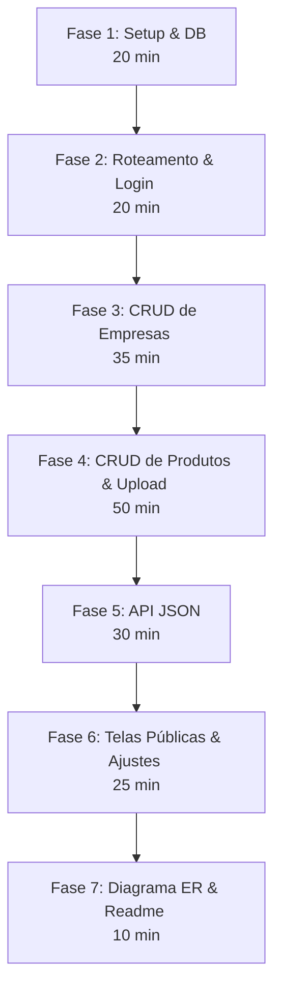

# Rota de Estudos e Execução para a Prova TP_B (Module B - Products Management)

Este guia foi elaborado a partir da análise detalhada do arquivo descritivo da prova [TP_B_pt-br.pdf](file:///c:/Users/Guilherme%20Bazon/Desktop/teste/docs/TP_B_pt-br.pdf) e da planilha de critérios de avaliação [CIS.xlsx](file:///c:/Users/Guilherme%20Bazon/Desktop/teste/docs/CIS.xlsx). 

O seu objetivo é guiá-lo no aprendizado rápido e na estratégia ideal de execução para **pontuar o máximo possível no menor tempo de prova (meta: 3 horas)**.

---

## 📊 Análise de Pontuação do CIS (Foco de Valor)

Para passar com nota alta, você deve priorizar os critérios que entregam mais pontos pelo esforço exigido. Veja a distribuição dos **23.5 pontos totais** do Módulo B:

| Subcritério | Descrição | Tipo | Pontos | Dificuldade | Estratégia de Execução |
| :--- | :--- | :---: | :---: | :---: | :--- |
| **B4** | Produtos CRUD (Admin) | Medição | **7.75** | Média | **Foco Principal**. Edição de imagem, GTIN (13/14 dígitos) e regras de login. |
| **B5** | API de Produtos (JSON) | Medição | **4.50** | Baixa | **Fácil de gabaritar**. Respostas JSON estruturadas, paginação e filtro `?query`. |
| **B3** | Empresas (Admin) | Medição | **4.25** | Baixa | Listas, criação e desativação (soft delete). |
| **B2** | Base de dados (MySQL) | Medição/Julg. | **2.50** | Baixa | Script `.sql` completo com FKs, Diagrama ER e GTIN indexado. |
| **B6** | Consulta e verificação de GTIN | Medição | **1.75** | Baixa | Validação em lote via textarea pública. |
| **B7** | Página do produto pública | Medição | **1.50** | Média | Layout responsivo (mobile-first) e suporte bilíngue (EN/FR). |
| **B1** | Admin & Acesso Geral | Medição | **1.25** | Baixa | Login com senha "admin" em `/login` e arquivo `expert_readme.txt`. |

---

## 🗺️ Rota de Execução Passo a Passo (O Caminho Mais Fácil)

O maior erro dos competidores é tentar desenhar telas bonitas antes de ter o roteamento e a base funcionando. Siga esta ordem lógica para não travar:



---

### 🗄️ Fase 1: Setup e Estrutura de Banco de Dados (20 min)
Crie a estrutura do banco usando boas práticas de modelagem para garantir os **2.50 pontos** de **B2**.

1. **Defina as Tabelas**: Utilize a estrutura do MySQL que já analisamos. Certifique-se de usar chaves estrangeiras (`FOREIGN KEY`) e declarar o campo `gtin` como `UNIQUE` e `INDEX`.
2. **Criação do Script SQL**: Salve o dump estruturado em um arquivo (ex: `db.sql`).
3. **Crie a Conexão**: Crie um arquivo centralizado de conexão com o banco usando PDO (ex: `db.php`) para evitar repetição de código.

> [!TIP]
> **Dica para ganhar nota máxima de Julgamento no Banco (B2):**
> - Não use apenas `VARCHAR` ou `TEXT` para tudo. Use `DECIMAL` para pesos, `TINYINT` para booleanos (como `deactivated` e `hidden`) e `TIMESTAMP` para datas.
> - Adicione comentários nas colunas de status (ex: `COMMENT '0=active, 1=deactivated'`).

---

### 🌐 Fase 2: Roteamento Limpo e Autenticação (20 min)
Para atender às URLs exigidas (`/login`, `/products`, `/products/new`), você precisará de uma solução de roteamento simples no arquivo [index.php](file:///c:/Users/Guilherme%20Bazon/Desktop/teste/index.php).

1. **Configuração do `.htaccess`**:
   Crie um arquivo `.htaccess` na raiz do seu projeto para direcionar todas as requisições que não forem arquivos físicos para o seu [index.php](file:///c:/Users/Guilherme%20Bazon/Desktop/teste/index.php):
   ```apache
   RewriteEngine On
   RewriteCond %{REQUEST_FILENAME} !-f
   RewriteCond %{REQUEST_FILENAME} !-d
   RewriteRule ^(.*)$ index.php [QSA,L]
   ```

2. **Roteador no [index.php](file:///c:/Users/Guilherme%20Bazon/Desktop/teste/index.php)**:
   Use este código limpo para gerenciar as rotas dinamicamente, independentemente da subpasta/porta em que o servidor esteja rodando:
   ```php
   <?php
   session_start();
   
   // Conexão com o banco (ajuste o caminho)
   require_once 'db.php';

   // Detecta o diretório base dinamicamente (ex: /XX_module_b)
   $base_dir = dirname($_SERVER['SCRIPT_NAME']);
   $request_uri = parse_url($_SERVER['REQUEST_URI'], PHP_URL_PATH);
   
   // Remove o diretório base do path de busca
   if ($base_dir !== '/' && strpos($request_uri, $base_dir) === 0) {
       $path = substr($request_uri, strlen($base_dir));
   } else {
       $path = $request_uri;
   }
   $path = '/' . trim($path, '/');

   // Helper para verificar autenticação (B4)
   function check_auth() {
       if (!isset($_SESSION['logged_in']) || $_SESSION['logged_in'] !== true) {
           http_response_code(401);
           echo "<h1>401 Unauthorized</h1>";
           exit;
       }
   }

   // Roteador
   switch ($path) {
       case '/login':
           require 'login.php';
           break;
       case '/logout':
           session_destroy();
           header("Location: login");
           break;
       case '/companies':
           check_auth();
           require 'companies_list.php';
           break;
       case '/companies/new':
           check_auth();
           require 'company_create.php';
           break;
       case '/products':
           check_auth();
           require 'products_list.php';
           break;
       case '/products/new':
           check_auth();
           require 'product_create.php';
           break;
       case '/products.json':
           require 'api_products_list.php';
           break;
       case '/gtin-verify':
           require 'public_gtin_verify.php';
           break;
       default:
           // Regex para rotas dinâmicas:
           // 1. /products/[GTIN] (Admin)
           if (preg_match('#^/products/([0-9]{13,14})$#', $path, $matches)) {
               check_auth();
               $_GET['gtin'] = $matches[1];
               require 'product_detail.php';
               break;
           }
           // 2. /products/[GTIN].json (API)
           if (preg_match('#^/products/([0-9]{13,14})\.json$#', $path, $matches)) {
               $_GET['gtin'] = $matches[1];
               require 'api_product_detail.php';
               break;
           }
           // 3. /01/[GTIN] (Public Facing)
           if (preg_match('#^/01/([0-9]{13,14})$#', $path, $matches)) {
               $_GET['gtin'] = $matches[1];
               require 'public_product.php';
               break;
           }
           
           // Página inicial / redireciona para login se não logado
           if (isset($_SESSION['logged_in']) && $_SESSION['logged_in'] === true) {
               header("Location: companies");
           } else {
               header("Location: login");
           }
           break;
   }
   ```

3. **Ajuste o [login.php](file:///c:/Users/Guilherme%20Bazon/Desktop/teste/login.php)**:
   Altere seu login para de fato iniciar a sessão:
   ```php
   <?php
   // session_start() já foi chamado no index.php
   $error = "";
   if ($_SERVER['REQUEST_METHOD'] === 'POST') {
       $senha = $_POST['senha'] ?? '';
       if ($senha === 'admin') {
           $_SESSION['logged_in'] = true;
           header("Location: companies");
           exit;
       } else {
           $error = "Senha incorreta.";
       }
   }
   ?>
   <!-- Formulário HTML simples aqui -->
   ```

---

### 🏢 Fase 3: CRUD de Empresas - Painel Admin (35 min)
Crie a gestão de empresas com foco nas regras de negócio exigidas em **B3**:

1. **Listagem (`companies_list.php`)**:
   - Faça um SELECT trazendo todas as empresas. 
   - Mostre uma tabela com as colunas (Nome, Telefone, Email, Proprietário, Contato, Status).
   - Tenha um botão/filtro para visualizar a "Lista de Desativadas".
   - **Nota de Ouro:** Não implemente botão de Exclusão (`DELETE`) para empresas na interface web. Apenas desativação.
2. **Criação & Edição**:
   - Form com todos os campos de contato e proprietário estruturados.
3. **Desativação (Soft Delete)**:
   - Ao marcar como desativada, rode uma query dupla usando PDO Transactions:
     - `UPDATE companies SET deactivated = 1 WHERE id = :id`
     - `UPDATE products SET hidden = 1 WHERE company_id = :id` *(Importante: O CIS exige que ao desativar a empresa, todos os seus produtos fiquem ocultos!)*

---

### 📦 Fase 4: CRUD de Produtos e Upload de Imagens (50 min)
Esta fase dá a maior pontuação da prova (**7.75 pontos**). Atenção máxima:

1. **Validação do GTIN**:
   - No envio do formulário, verifique no PHP se o campo tem exatamente 13 ou 14 caracteres de comprimento e se é puramente numérico.
   - Faça uma query para certificar que este GTIN já não existe no banco (deve ser único).
2. **Idiomas (EN/FR)**:
   - O formulário deve conter campos separados para nome e descrição em inglês e francês (`name_en`, `name_fr`, `description_en`, `description_fr`).
3. **Upload de Imagem (Adicionar, Alterar, Remover)**:
   - Implemente um fluxo robusto para upload de arquivos de imagem na pasta `uploads/`.
   - Se nenhuma imagem for enviada ao criar o produto, utilize um caminho de imagem placeholder padrão (ex: `assets/placeholder.png`).
4. **Exclusão de Ocultos**:
   - Permitir a exclusão definitiva do produto **apenas se ele estiver oculto** (`hidden = 1` ou a empresa dele estiver desativada). O botão de deletar só deve aparecer para produtos ocultos.

---

### 🔌 Fase 5: API JSON (30 min)
A API vale **4.50 pontos** e é muito simples de pontuar usando a função `json_encode()` do PHP.

1. **`/products.json` (Listagem, Busca e Paginação)**:
   - Leia o parâmetro `?page` (padrão é 1) e `?query`.
   - Se houver `?query=VALOR`, filtre no banco por `name_en`, `name_fr`, `description_en` ou `description_fr` usando `LIKE %VALOR%`.
   - Limite a paginação a 10 produtos por página.
   - Retorne o JSON no formato exato solicitado pelo CIS (veja o exemplo abaixo).
2. **`/products/[GTIN].json` (Detalhe do Produto)**:
   - Busque pelo GTIN. 
   - **Atenção:** Se o produto não existir ou estiver oculto (`hidden = 1`), retorne imediatamente `http_response_code(404)` e um JSON de erro.

> [!IMPORTANT]
> **Formato do JSON de Paginação esperado no CIS:**
> ```json
> {
>   "data": [
>     { "name": { "en": "...", "fr": "..." }, "gtin": "...", "brand": "...", ... }
>   ],
>   "pagination": {
>     "current_page": 1,
>     "total_pages": 3,
>     "per_page": 10,
>     "next_page_url": "http://...",
>     "prev_page_url": null
>   }
> }
> ```

---

### 👥 Fase 6: Páginas Públicas (25 min)
As páginas públicas não precisam de login (não chame `check_auth()` nelas).

1. **Consulta em Massa (`/gtin-verify`)**:
   - Crie uma tela contendo uma `<textarea>` onde o usuário possa digitar vários GTINs (um por linha).
   - Ao submeter, divida o texto com `explode("\n", $_POST['textarea'])`.
   - Para cada linha, limpe espaços com `trim()` e verifique no banco se o produto existe e se `hidden = 0`.
   - Mostre uma lista com os resultados (`Valid` ou `Invalid`).
   - Se todos forem válidos, exiba a mensagem `"Todos os válidos"` e uma imagem ou caractere de "check" verde.
2. **Página de Detalhe Pública (`/01/[GTIN]`)**:
   - Exiba os dados estruturados em uma página limpa e responsiva (adequada para mobile).
   - Coloque um seletor de idioma (Inglês / Francês).
   - Ao alterar o idioma (ex: via parâmetro `?lang=fr` na URL), carregue os campos correspondentes (`name_fr` e `description_fr`) e **não se esqueça** de alterar a tag HTML para `<html lang="fr">` ou `<html lang="en">` (isto vale pontos no CIS!).

---

### 📝 Fase 7: Entregáveis e Documentação (10 min)
Para garantir que os avaliadores executem e pontuem o seu projeto sem problemas:

1. **Diagrama ER**:
   - Exporte um diagrama das tabelas do banco de dados em formato de imagem na pasta `docs/`.
2. **Arquivo `expert_readme.txt`**:
   - Crie este arquivo contendo os passos básicos para rodar o projeto (ex: como importar o banco de dados, credenciais de acesso, e comandos de inicialização).

---

## 💡 Dicas de Ouro para a Prova

- ⚠️ **Erro 401 Sem Login**: Certifique-se de que a função `check_auth()` realmente bloqueia o acesso direto nas rotas do painel admin. Os scripts de automação de testes dos avaliadores batem forte nesse critério.
- 💾 **Commit do Git**: Faça commits curtos e claros a cada fase terminada (ex: `feat: implement login and database connection`). O histórico de git organizado é julgado em competições.
- ⏱️ **Gestão de Tempo**: Não gaste mais que 5 minutos estilizando botões ou escolhendo fontes antes que a lógica inteira de banco e roteamento esteja pronta. Funcionalidade vale 90% da pontuação, o design é secundário.

---

## 🛠️ O Que Fazer Agora?

Para começar a praticar e fixar esses conceitos:
1. Revise a lógica de **Roteamento Dinâmico** sugerida na Fase 2.
2. Crie os arquivos estruturais vazios na raiz do seu projeto para começar a preencher:
   - `db.php`
   - `index.php` (utilizando a estrutura de switch/case)
   - `login.php`
   - `companies_list.php`
   - `products_list.php`
   - `public_gtin_verify.php`
   - `public_product.php`

Com essa estratégia, você conseguirá cobrir todos os critérios exigidos pelo CIS de forma limpa e rápida. Bons estudos nesta semana!
